# Financial and Graph Visualization

Design explainable, reproducible financial and network visuals — without
generative images.

`financial-graph-visualization` is a source-grounded skill for turning a
financial or graph question into a defensible visual grammar, layout,
interaction model, and editable code-native implementation.

[](https://github.com/nutdnuy/financial-graph-visualization/releases/latest)
[](examples/)

The editable [social preview source](assets/social-preview.svg) is included
for repository sharing. Export it to PNG when uploading a custom GitHub Social
Preview under repository Settings.

## Quick links

| Need | Start here |
|---|---|
| See working output | [Examples](examples/) |
| Install the skill | [Install as an agent skill](#install-as-an-agent-skill) |
| Copy a prompt | [Copy-ready prompts](#copy-ready-prompts) |
| Follow one input to one output | [Complete walkthrough](#complete-walkthrough) |
| Choose a chapter | [Coverage catalog](docs/CATALOG.md) |
| Browse all cards | [Visual catalog](#visual-catalog) |
| Use light or dark theme | Cards follow the browser color preference |
| Check the package | `python3 scripts/validate_examples.py` |

## See it in 30 seconds

The examples are dependency-free HTML/SVG files using labeled synthetic data.
Open any `index.html` directly in a browser, or serve the repository locally:

```bash
python3 -m http.server 8000
```

Then open:

- [Portfolio comparison tiles](examples/portfolio-tile/) — normalized security profiles and benchmark context
- [Performance waterfall](examples/performance-waterfall/) — deterministic contribution and return decomposition
- [Transaction network](examples/transaction-network/) — fixed-position graph layout with typed, weighted links

Validate the three example documents without installing dependencies:

```bash
python3 scripts/validate_examples.py
```

### Portfolio comparison


### Performance waterfall


### Transaction network


Every preview has an editable HTML/SVG source beside it. The examples are
illustrative and do not provide investment advice.

Browse the full visual catalog: [all chapter and example cards](docs/CATALOG.md#visual-card-gallery).

<h2 id="visual-catalog">Visual catalog</h2>

<p>Browse all 26 chapter and example cards from the home page. Every card uses a distinct, content-specific visual motif rather than a repeated category template. The thumbnails are code-generated SVGs with a light fallback and dark-mode variant, so the gallery remains readable in either theme.</p>

<table>
<tr>
<td width="33%" valign="top">
<a href="chapters/ch01-financial-visual-communications.md"><picture><source media="(prefers-color-scheme: dark)" srcset="docs/assets/catalog/ch01.svg">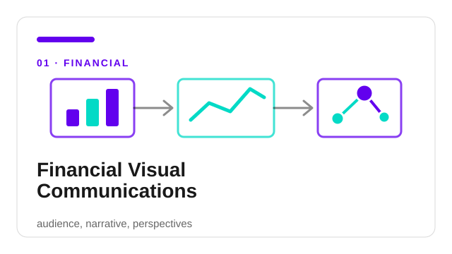</picture></a>
<p><strong><a href="chapters/ch01-financial-visual-communications.md">Financial Visual Communications</a></strong><br>
<em>audience, narrative, and multiple perspectives.</em><br>
<a href="chapters/ch01-financial-visual-communications.md">CH01</a></p>
</td>
<td width="33%" valign="top">
<a href="chapters/ch02-benefits-of-visual-methods.md"><picture><source media="(prefers-color-scheme: dark)" srcset="docs/assets/catalog/ch02.svg">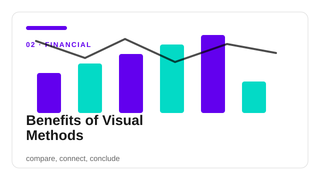</picture></a>
<p><strong><a href="chapters/ch02-benefits-of-visual-methods.md">Benefits of Visual Methods</a></strong><br>
<em>compare, connect, and conclude.</em><br>
<a href="chapters/ch02-benefits-of-visual-methods.md">CH02</a></p>
</td>
<td width="33%" valign="top">
<a href="chapters/ch03-security-assessment-tile-framework.md"><picture><source media="(prefers-color-scheme: dark)" srcset="docs/assets/catalog/ch03.svg">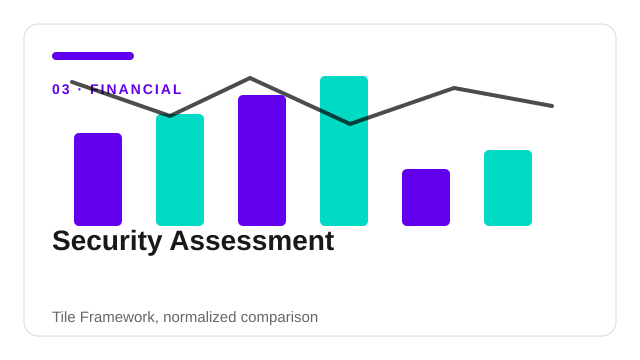</picture></a>
<p><strong><a href="chapters/ch03-security-assessment-tile-framework.md">Security Assessment</a></strong><br>
<em>Tile Framework and normalized comparison.</em><br>
<a href="chapters/ch03-security-assessment-tile-framework.md">CH03</a></p>
</td>
</tr>
<tr>
<td width="33%" valign="top">
<a href="chapters/ch04-portfolio-construction.md"><picture><source media="(prefers-color-scheme: dark)" srcset="docs/assets/catalog/ch04.svg">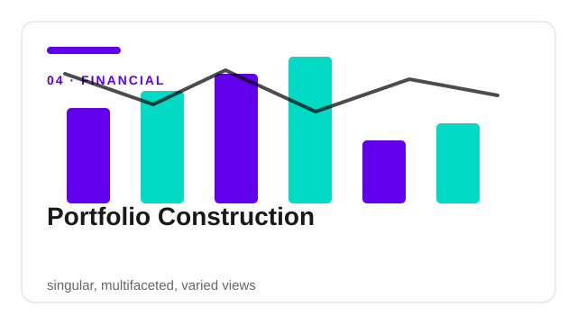</picture></a>
<p><strong><a href="chapters/ch04-portfolio-construction.md">Portfolio Construction</a></strong><br>
<em>singular, multifaceted, and varied views.</em><br>
<a href="chapters/ch04-portfolio-construction.md">CH04</a></p>
</td>
<td width="33%" valign="top">
<a href="chapters/ch05-trading-visual-system.md"><picture><source media="(prefers-color-scheme: dark)" srcset="docs/assets/catalog/ch05.svg">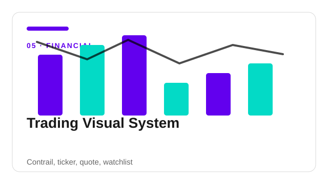</picture></a>
<p><strong><a href="chapters/ch05-trading-visual-system.md">Trading Visual System</a></strong><br>
<em>Contrail, ticker, quote, and watchlist.</em><br>
<a href="chapters/ch05-trading-visual-system.md">CH05</a></p>
</td>
<td width="33%" valign="top">
<a href="chapters/ch06-performance-measurement.md"><picture><source media="(prefers-color-scheme: dark)" srcset="docs/assets/catalog/ch06.svg">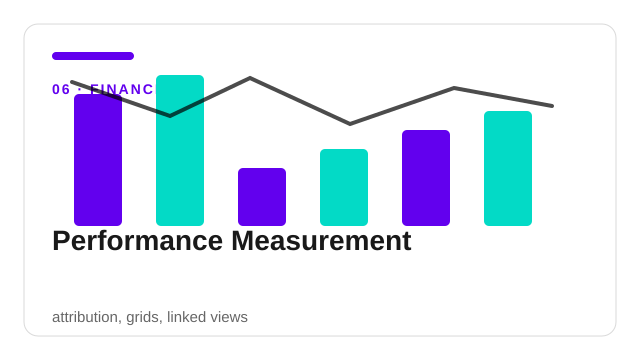</picture></a>
<p><strong><a href="chapters/ch06-performance-measurement.md">Performance Measurement</a></strong><br>
<em>attribution, grids, and linked views.</em><br>
<a href="chapters/ch06-performance-measurement.md">CH06</a></p>
</td>
</tr>
<tr>
<td width="33%" valign="top">
<a href="chapters/ch07-financial-statements.md"><picture><source media="(prefers-color-scheme: dark)" srcset="docs/assets/catalog/ch07.svg">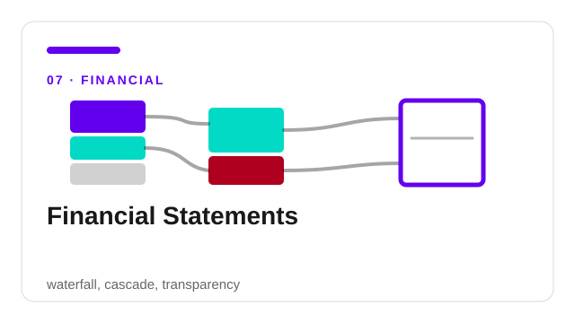</picture></a>
<p><strong><a href="chapters/ch07-financial-statements.md">Financial Statements</a></strong><br>
<em>waterfall, cascade, and transparency.</em><br>
<a href="chapters/ch07-financial-statements.md">CH07</a></p>
</td>
<td width="33%" valign="top">
<a href="chapters/ch08-pension-funds.md"><picture><source media="(prefers-color-scheme: dark)" srcset="docs/assets/catalog/ch08.svg">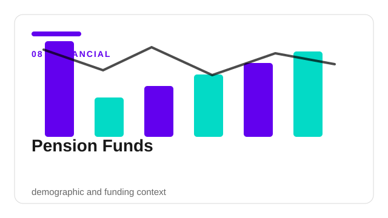</picture></a>
<p><strong><a href="chapters/ch08-pension-funds.md">Pension Funds</a></strong><br>
<em>demographic and funding context.</em><br>
<a href="chapters/ch08-pension-funds.md">CH08</a></p>
</td>
<td width="33%" valign="top">
<a href="chapters/ch09-mutual-funds.md"><picture><source media="(prefers-color-scheme: dark)" srcset="docs/assets/catalog/ch09.svg">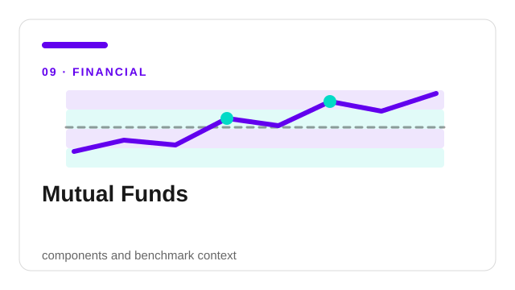</picture></a>
<p><strong><a href="chapters/ch09-mutual-funds.md">Mutual Funds</a></strong><br>
<em>reusable components and benchmark context.</em><br>
<a href="chapters/ch09-mutual-funds.md">CH09</a></p>
</td>
</tr>
<tr>
<td width="33%" valign="top">
<a href="chapters/ch10-hedge-funds.md"><picture><source media="(prefers-color-scheme: dark)" srcset="docs/assets/catalog/ch10.svg">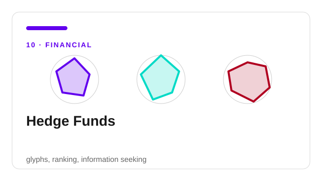</picture></a>
<p><strong><a href="chapters/ch10-hedge-funds.md">Hedge Funds</a></strong><br>
<em>glyphs, ranking, and information seeking.</em><br>
<a href="chapters/ch10-hedge-funds.md">CH10</a></p>
</td>
<td width="33%" valign="top">
<a href="chapters/ch11-financial-visualization-principles.md"><picture><source media="(prefers-color-scheme: dark)" srcset="docs/assets/catalog/ch11.svg">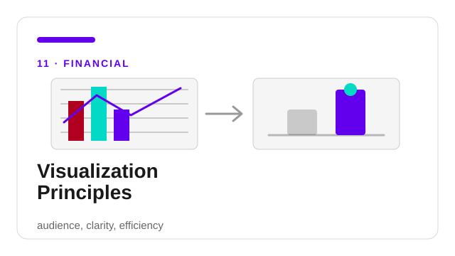</picture></a>
<p><strong><a href="chapters/ch11-financial-visualization-principles.md">Visualization Principles</a></strong><br>
<em>audience, clarity, and efficiency.</em><br>
<a href="chapters/ch11-financial-visualization-principles.md">CH11</a></p>
</td>
<td width="33%" valign="top">
<a href="chapters/ch12-implementing-financial-visuals.md"><picture><source media="(prefers-color-scheme: dark)" srcset="docs/assets/catalog/ch12.svg">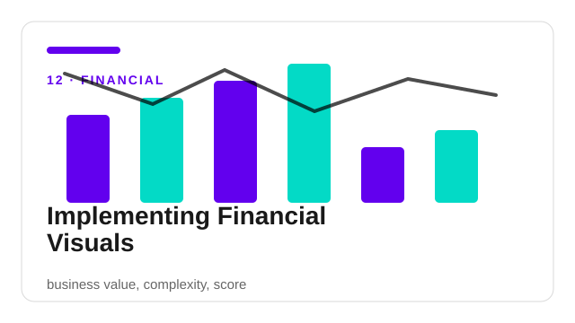</picture></a>
<p><strong><a href="chapters/ch12-implementing-financial-visuals.md">Implementing Financial Visuals</a></strong><br>
<em>business value, complexity, and score.</em><br>
<a href="chapters/ch12-implementing-financial-visuals.md">CH12</a></p>
</td>
</tr>
<tr>
<td width="33%" valign="top">
<a href="chapters/ch13-graph-visualization-basics.md"><picture><source media="(prefers-color-scheme: dark)" srcset="docs/assets/catalog/ch13.svg">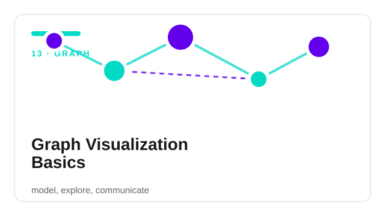</picture></a>
<p><strong><a href="chapters/ch13-graph-visualization-basics.md">Graph Visualization Basics</a></strong><br>
<em>model, explore, and communicate.</em><br>
<a href="chapters/ch13-graph-visualization-basics.md">CH13</a></p>
</td>
<td width="33%" valign="top">
<a href="chapters/ch14-graph-case-studies.md"><picture><source media="(prefers-color-scheme: dark)" srcset="docs/assets/catalog/ch14.svg">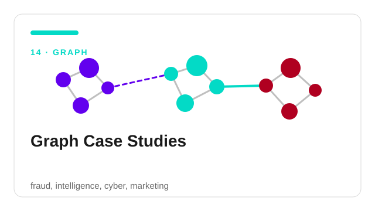</picture></a>
<p><strong><a href="chapters/ch14-graph-case-studies.md">Graph Case Studies</a></strong><br>
<em>fraud, intelligence, cyber, and marketing.</em><br>
<a href="chapters/ch14-graph-case-studies.md">CH14</a></p>
</td>
<td width="33%" valign="top">
<a href="chapters/ch15-gephi-and-keylines.md"><picture><source media="(prefers-color-scheme: dark)" srcset="docs/assets/catalog/ch15.svg">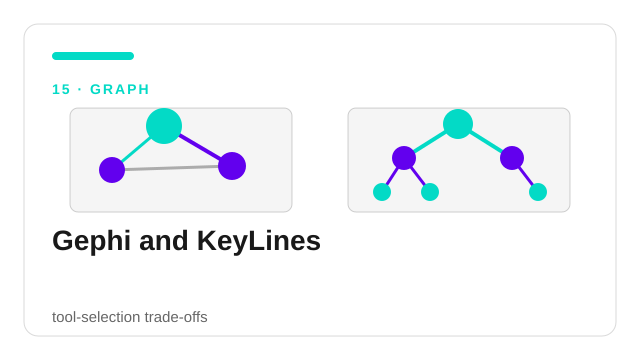</picture></a>
<p><strong><a href="chapters/ch15-gephi-and-keylines.md">Gephi and KeyLines</a></strong><br>
<em>tool-selection trade-offs.</em><br>
<a href="chapters/ch15-gephi-and-keylines.md">CH15</a></p>
</td>
</tr>
<tr>
<td width="33%" valign="top">
<a href="chapters/ch16-graph-data-modeling.md"><picture><source media="(prefers-color-scheme: dark)" srcset="docs/assets/catalog/ch16.svg">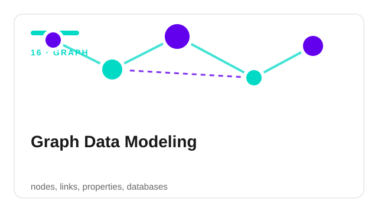</picture></a>
<p><strong><a href="chapters/ch16-graph-data-modeling.md">Graph Data Modeling</a></strong><br>
<em>nodes, links, properties, and databases.</em><br>
<a href="chapters/ch16-graph-data-modeling.md">CH16</a></p>
</td>
<td width="33%" valign="top">
<a href="chapters/ch17-building-graph-visualizations.md"><picture><source media="(prefers-color-scheme: dark)" srcset="docs/assets/catalog/ch17.svg">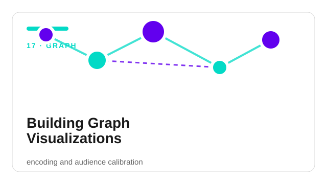</picture></a>
<p><strong><a href="chapters/ch17-building-graph-visualizations.md">Building Graph Visualizations</a></strong><br>
<em>encoding and audience calibration.</em><br>
<a href="chapters/ch17-building-graph-visualizations.md">CH17</a></p>
</td>
<td width="33%" valign="top">
<a href="chapters/ch18-interactive-graph-visualizations.md"><picture><source media="(prefers-color-scheme: dark)" srcset="docs/assets/catalog/ch18.svg">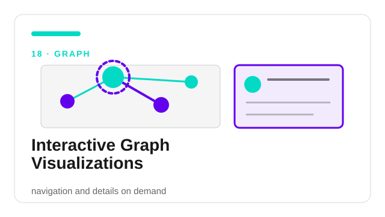</picture></a>
<p><strong><a href="chapters/ch18-interactive-graph-visualizations.md">Interactive Graph Visualizations</a></strong><br>
<em>navigation and details on demand.</em><br>
<a href="chapters/ch18-interactive-graph-visualizations.md">CH18</a></p>
</td>
</tr>
<tr>
<td width="33%" valign="top">
<a href="chapters/ch19-graph-layouts.md"><picture><source media="(prefers-color-scheme: dark)" srcset="docs/assets/catalog/ch19.svg">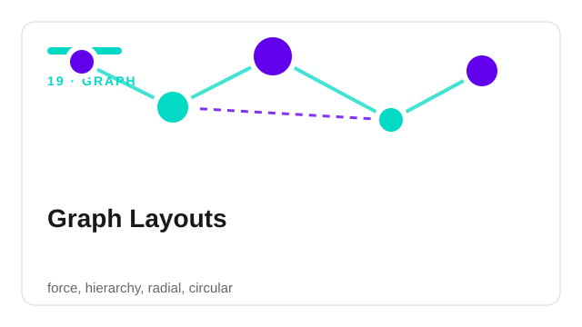</picture></a>
<p><strong><a href="chapters/ch19-graph-layouts.md">Graph Layouts</a></strong><br>
<em>force, hierarchy, radial, and circular.</em><br>
<a href="chapters/ch19-graph-layouts.md">CH19</a></p>
</td>
<td width="33%" valign="top">
<a href="chapters/ch20-big-graph-data.md"><picture><source media="(prefers-color-scheme: dark)" srcset="docs/assets/catalog/ch20.svg">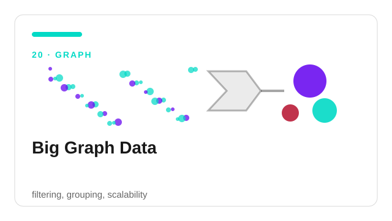</picture></a>
<p><strong><a href="chapters/ch20-big-graph-data.md">Big Graph Data</a></strong><br>
<em>filtering, grouping, and scalability.</em><br>
<a href="chapters/ch20-big-graph-data.md">CH20</a></p>
</td>
<td width="33%" valign="top">
<a href="chapters/ch21-dynamic-graphs.md"><picture><source media="(prefers-color-scheme: dark)" srcset="docs/assets/catalog/ch21.svg">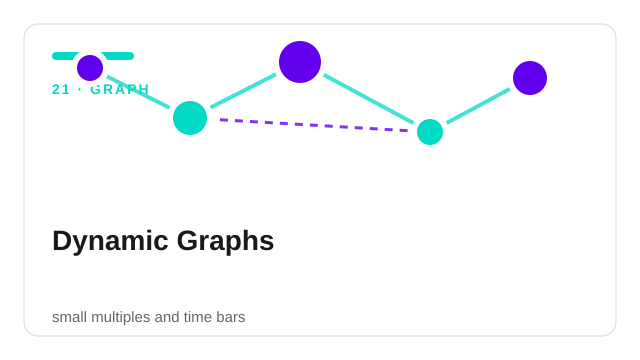</picture></a>
<p><strong><a href="chapters/ch21-dynamic-graphs.md">Dynamic Graphs</a></strong><br>
<em>small multiples and time bars.</em><br>
<a href="chapters/ch21-dynamic-graphs.md">CH21</a></p>
</td>
</tr>
<tr>
<td width="33%" valign="top">
<a href="chapters/ch22-graphs-on-maps.md"><picture><source media="(prefers-color-scheme: dark)" srcset="docs/assets/catalog/ch22.svg">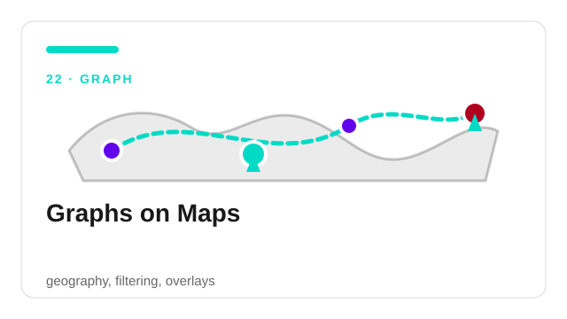</picture></a>
<p><strong><a href="chapters/ch22-graphs-on-maps.md">Graphs on Maps</a></strong><br>
<em>geography, filtering, and overlays.</em><br>
<a href="chapters/ch22-graphs-on-maps.md">CH22</a></p>
</td>
<td width="33%" valign="top">
<a href="chapters/ch23-d3js-appendix.md"><picture><source media="(prefers-color-scheme: dark)" srcset="docs/assets/catalog/ch23.svg">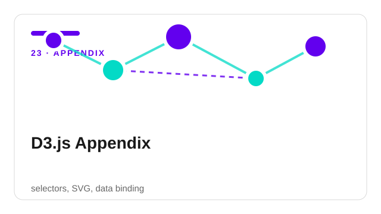</picture></a>
<p><strong><a href="chapters/ch23-d3js-appendix.md">D3.js Appendix</a></strong><br>
<em>selectors, SVG, data binding, and simulation.</em><br>
<a href="chapters/ch23-d3js-appendix.md">CH23</a></p>
</td>
<td width="33%" valign="top">
<a href="examples/portfolio-tile/"><picture><source media="(prefers-color-scheme: dark)" srcset="docs/assets/catalog/example-portfolio-tile.svg">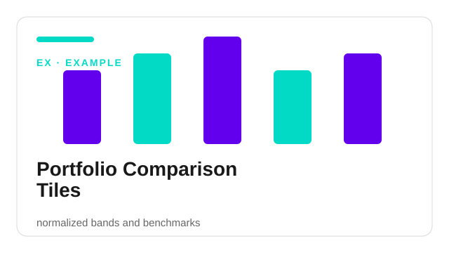</picture></a>
<p><strong><a href="examples/portfolio-tile/">Portfolio Comparison Tiles</a></strong><br>
<em>normalized bands and benchmark context.</em><br>
<a href="examples/portfolio-tile/">EXAMPLE</a></p>
</td>
</tr>
<tr>
<td width="33%" valign="top">
<a href="examples/performance-waterfall/"><picture><source media="(prefers-color-scheme: dark)" srcset="docs/assets/catalog/example-performance-waterfall.svg">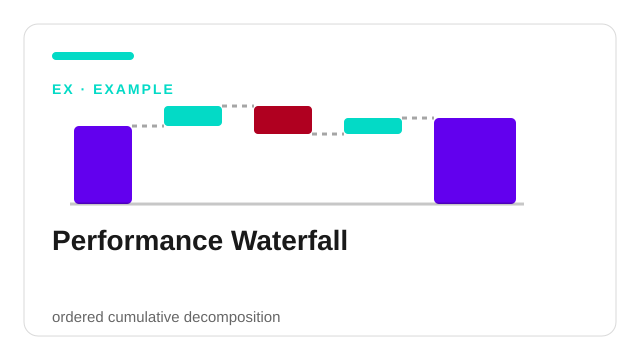</picture></a>
<p><strong><a href="examples/performance-waterfall/">Performance Waterfall</a></strong><br>
<em>ordered cumulative decomposition and audit labels.</em><br>
<a href="examples/performance-waterfall/">EXAMPLE</a></p>
</td>
<td width="33%" valign="top">
<a href="examples/transaction-network/"><picture><source media="(prefers-color-scheme: dark)" srcset="docs/assets/catalog/example-transaction-network.svg">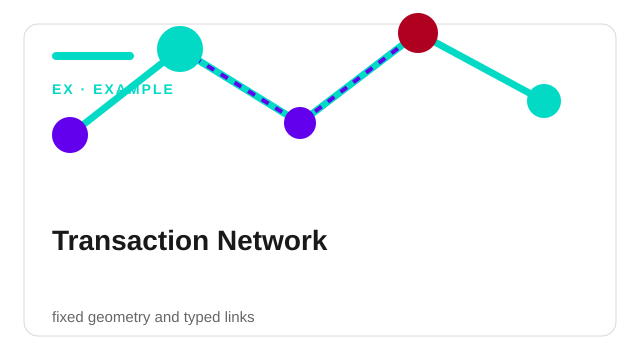</picture></a>
<p><strong><a href="examples/transaction-network/">Transaction Network</a></strong><br>
<em>fixed geometry and typed links.</em><br>
<a href="examples/transaction-network/">EXAMPLE</a></p>
</td>
</tr>
</table>

## Why this exists

- **Decision first:** start with the audience, question, comparator, and next action.
- **Traceable visuals:** every mark, value, position, size, and relationship maps to data or a declared rule.
- **Reproducible output:** deterministic code, explicit geometry, fixed seeds, and documented layout parameters.
- **Editable delivery:** SVG, HTML/CSS, Canvas, D3.js, Vega-Lite, Plotly, Matplotlib, NetworkX, Graphviz, or Cytoscape.js remain available for revision.
- **Evidence-aware:** source, method, cutoff, limitations, accessibility, and data status stay visible.
- **No image generation:** Image Generator, `image_gen`, and other generative-image models are prohibited by design.

## Install as an agent skill

Clone the standalone repository and symlink its root into the agent runtime:

```bash
git clone https://github.com/nutdnuy/financial-graph-visualization.git
cd financial-graph-visualization

mkdir -p ~/.claude/skills ~/.codex/skills
ln -sfn "$PWD" ~/.claude/skills/financial-graph-visualization
ln -sfn "$PWD" ~/.codex/skills/financial-graph-visualization
```

If your runtime uses another skills directory, copy or symlink this repository
folder there instead.

Supported local skill locations:

| Runtime | Skill directory |
|---|---|
| Claude Code | `~/.claude/skills/financial-graph-visualization` |
| Codex | `~/.codex/skills/financial-graph-visualization` |
| Other Agent Skills host | Its configured skills directory |

## Use it

Invoke the skill by name and provide the decision, data, audience, and delivery
format when known:

```text
Use financial-graph-visualization to choose a layout for this unfamiliar
transaction network. Explain the topology assumptions, filtering strategy,
and accessibility checks before writing deterministic SVG.
```

```text
Use financial-graph-visualization to design a normalized comparison tile for
these ETFs. Include benchmark context, units, a cutoff date, and an editable
code-native implementation.
```

```text
Use financial-graph-visualization to turn this return series into a waterfall
and attribution view. Keep the source data, calculation rules, and export
source together.
```

The skill routes requests to:

- Financial visualization: chapters `ch01` through `ch12`
- Graph and network visualization: chapters `ch13` through `ch23`
- Visual design decisions: `cheatsheet.md` and `patterns.md`
- Provenance and limits: `references/source-notes.md`
- Visual-reference routing: `references/visual-index.md`

## Copy-ready prompts

| Goal | Prompt starter |
|---|---|
| Compare securities | `Use financial-graph-visualization to normalize these securities into profile and results tiles. Preserve units, benchmark context, and the cutoff date.` |
| Explain drivers | `Use financial-graph-visualization to turn this total return into a waterfall. Show the ordered drivers, calculation rule, and editable SVG source.` |
| Choose a network layout | `Use financial-graph-visualization to compare force-directed, hierarchy, radial, and circular layouts for this topology and task.` |
| Reduce graph density | `Use financial-graph-visualization to design a server-side and client-side filtering strategy for this graph. State what is hidden and how users restore it.` |
| Audit a chart | `Use financial-graph-visualization to audit this chart for misleading scales, missing comparators, inaccessible color, unclear units, and unsupported claims.` |

## Complete walkthrough

### Input

Suppose a return attribution table contains an opening value, ordered positive
and negative drivers, a period, a unit, and a cutoff date.

### Route

The skill routes the task to performance measurement and financial-statement
patterns, then applies **Summary + Detail on Demand** and an ordered waterfall.

### Output

Start with the [performance waterfall example](examples/performance-waterfall/)
and replace the `components` array in `index.html`. The editable source keeps
the calculation, geometry, labels, and method note together.

### Verification

The example checks that `100 + 12 + 8 - 3 - 5 = 112`, labels the value index,
states that the data is synthetic, keeps positive and negative values distinct,
and renders without a random layout or external dependency.

## Package map

```text
SKILL.md                         # routing, decision system, and guardrails
cheatsheet.md                    # compact decision rules
patterns.md                      # reusable visualization patterns
glossary.md                      # terms with chapter references
chapters/                        # progressive-disclosure source synthesis
references/source-notes.md       # provenance and limitations
references/visual-index.md       # local-only visual routing index
examples/                        # runnable HTML/SVG demonstrations
scripts/validate_examples.py     # dependency-free smoke check
scripts/generate_catalog_cards.py # deterministic SVG card generator
docs/assets/catalog/              # generated visual card thumbnails
docs/assets/catalog/light/         # light-theme card thumbnails
docs/CATALOG.md                  # chapter and example catalog
```

## Coverage map

| Area | Chapters | Best starting point |
|---|---:|---|
| Financial communication and audience | `ch01`–`ch02`, `ch11` | [Core Decision System](SKILL.md#core-decision-system) |
| Security comparison and tiles | `ch03`, `ch09` | [Portfolio comparison example](examples/portfolio-tile/) |
| Portfolio, trading, and performance | `ch04`–`ch06` | [Patterns](patterns.md) |
| Statements, waterfalls, and funds | `ch07`–`ch10` | [Performance waterfall example](examples/performance-waterfall/) |
| Implementation and prioritization | `ch12` | `Solution Score` in [cheatsheet](cheatsheet.md) |
| Graph modeling and case studies | `ch13`–`ch17` | [Graph Model Before Graph Drawing](SKILL.md#graph-model-before-graph-drawing) |
| Interaction and scale | `ch18`, `ch20` | [Transaction network example](examples/transaction-network/) |
| Layouts and dynamic graphs | `ch19`, `ch21` | [Layout Follows Topology and Task](SKILL.md#layout-follows-topology-and-task) |
| Maps and D3.js | `ch22`–`ch23` | [Chapter catalog](docs/CATALOG.md) |

## Verification contract

Before delivery, confirm that:

1. The audience, decision, comparator, period, units, and cutoff are explicit.
2. Values and visual relationships are calculated from data or labeled assumptions.
3. A stochastic layout records its seed and parameters, or uses fixed geometry.
4. Color is paired with labels, icons, or text for semantic states.
5. Scales, baselines, labels, accessibility, and responsive behavior are checked.
6. The editable source remains with any raster export.
7. No generative-image tool was used.

## Sources and distribution boundary

The skill synthesizes *Visualizing Financial Data* by Julie Rodriguez and Piotr
Kaczmarek and *Visualizing Graph Data* by Corey L. Lanum. The source PDFs and
full-page rendered book references are intentionally excluded. Those renders
are local personal-study excerpts, not licensed templates or distributable
assets.

This repository contains a concise synthesis and original deterministic
examples, not a replacement for the source books. Tool behavior described by
the 2016-2017 sources may be outdated; verify current APIs before implementation.
See [NOTICE.md](NOTICE.md) for the source and usage boundary.

## Contributing and support

Open an issue with a minimal dataset, the intended decision, the expected
visual relationship, and the current output. Keep examples synthetic or
properly licensed. Proposed visual changes should include the editable source,
validation notes, and an explanation of why the encoding improves the decision.
