# Financial and Graph Visualization Catalog

This catalog is the short path through the full skill. Read the root
[`SKILL.md`](../SKILL.md) first, then open only the chapter needed for the
current decision.

<h2 id="visual-card-gallery">Visual card gallery</h2>

Browse the skill as a visual catalog. Each card is a deterministic SVG thumbnail generated from explicit geometry and linked to the relevant chapter or example.

<table>
<tr>
<td width="33%" valign="top">

<a href="../chapters/ch01-financial-visual-communications.md">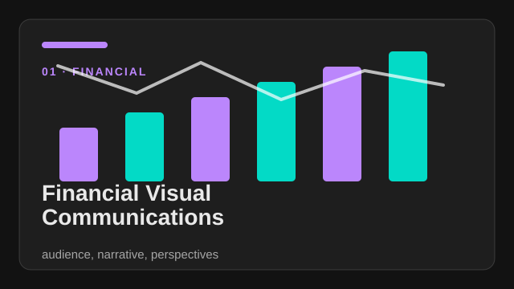</a>

<strong><a href="../chapters/ch01-financial-visual-communications.md">Financial Visual Communications</a></strong> 
<em>audience, narrative, and multiple perspectives.</em> 
<a href="../chapters/ch01-financial-visual-communications.md">CH01</a> · <a href="../SKILL.md">skill route</a>

</td>
<td width="33%" valign="top">

<a href="../chapters/ch02-benefits-of-visual-methods.md">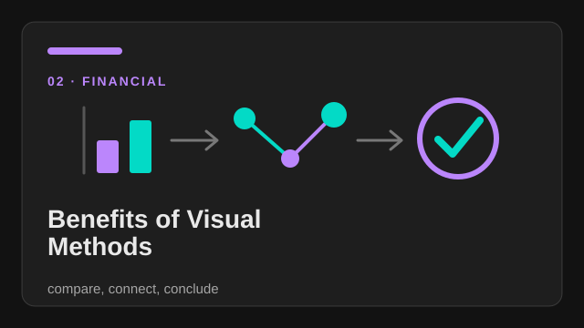</a>

<strong><a href="../chapters/ch02-benefits-of-visual-methods.md">Benefits of Visual Methods</a></strong> 
<em>compare, connect, and conclude.</em> 
<a href="../chapters/ch02-benefits-of-visual-methods.md">CH02</a> · <a href="../SKILL.md">skill route</a>

</td>
<td width="33%" valign="top">

<a href="../chapters/ch03-security-assessment-tile-framework.md">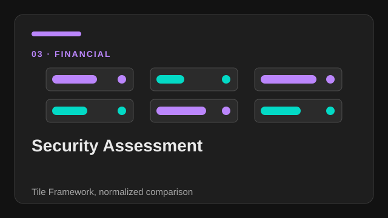</a>

<strong><a href="../chapters/ch03-security-assessment-tile-framework.md">Security Assessment</a></strong> 
<em>Tile Framework and normalized comparison.</em> 
<a href="../chapters/ch03-security-assessment-tile-framework.md">CH03</a> · <a href="../SKILL.md">skill route</a>

</td>
</tr>
<tr>
<td width="33%" valign="top">

<a href="../chapters/ch04-portfolio-construction.md">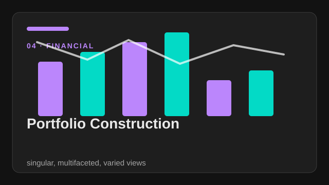</a>

<strong><a href="../chapters/ch04-portfolio-construction.md">Portfolio Construction</a></strong> 
<em>singular, multifaceted, and varied views.</em> 
<a href="../chapters/ch04-portfolio-construction.md">CH04</a> · <a href="../SKILL.md">skill route</a>

</td>
<td width="33%" valign="top">

<a href="../chapters/ch05-trading-visual-system.md">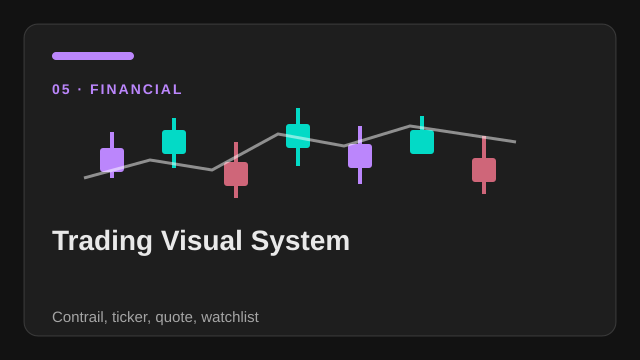</a>

<strong><a href="../chapters/ch05-trading-visual-system.md">Trading Visual System</a></strong> 
<em>Contrail, ticker, quote, and watchlist.</em> 
<a href="../chapters/ch05-trading-visual-system.md">CH05</a> · <a href="../SKILL.md">skill route</a>

</td>
<td width="33%" valign="top">

<a href="../chapters/ch06-performance-measurement.md">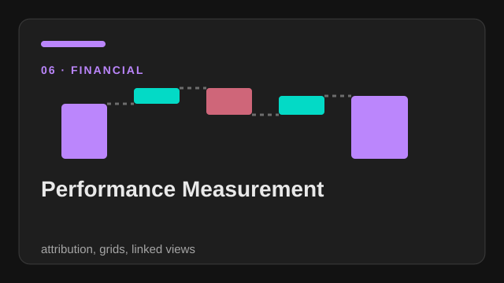</a>

<strong><a href="../chapters/ch06-performance-measurement.md">Performance Measurement</a></strong> 
<em>attribution, grids, and linked views.</em> 
<a href="../chapters/ch06-performance-measurement.md">CH06</a> · <a href="../SKILL.md">skill route</a>

</td>
</tr>
<tr>
<td width="33%" valign="top">

<a href="../chapters/ch07-financial-statements.md">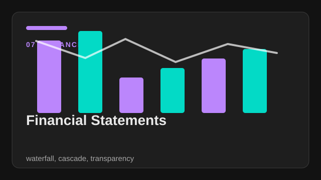</a>

<strong><a href="../chapters/ch07-financial-statements.md">Financial Statements</a></strong> 
<em>waterfall, cascade, and transparency.</em> 
<a href="../chapters/ch07-financial-statements.md">CH07</a> · <a href="../SKILL.md">skill route</a>

</td>
<td width="33%" valign="top">

<a href="../chapters/ch08-pension-funds.md">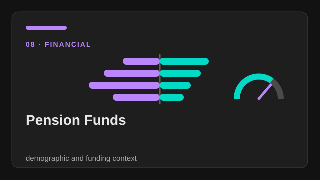</a>

<strong><a href="../chapters/ch08-pension-funds.md">Pension Funds</a></strong> 
<em>demographic and funding context.</em> 
<a href="../chapters/ch08-pension-funds.md">CH08</a> · <a href="../SKILL.md">skill route</a>

</td>
<td width="33%" valign="top">

<a href="../chapters/ch09-mutual-funds.md">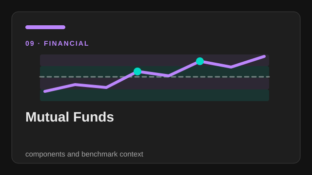</a>

<strong><a href="../chapters/ch09-mutual-funds.md">Mutual Funds</a></strong> 
<em>reusable components and benchmark context.</em> 
<a href="../chapters/ch09-mutual-funds.md">CH09</a> · <a href="../SKILL.md">skill route</a>

</td>
</tr>
<tr>
<td width="33%" valign="top">

<a href="../chapters/ch10-hedge-funds.md">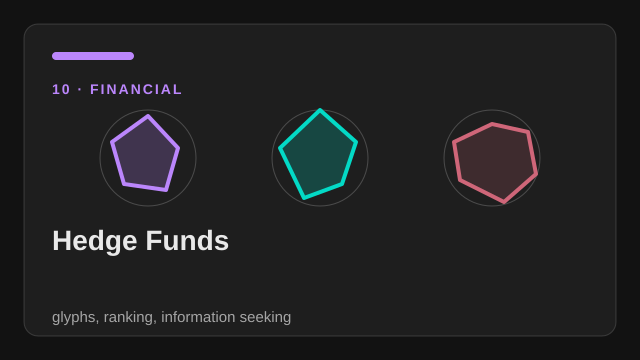</a>

<strong><a href="../chapters/ch10-hedge-funds.md">Hedge Funds</a></strong> 
<em>glyphs, ranking, and information seeking.</em> 
<a href="../chapters/ch10-hedge-funds.md">CH10</a> · <a href="../SKILL.md">skill route</a>

</td>
<td width="33%" valign="top">

<a href="../chapters/ch11-financial-visualization-principles.md">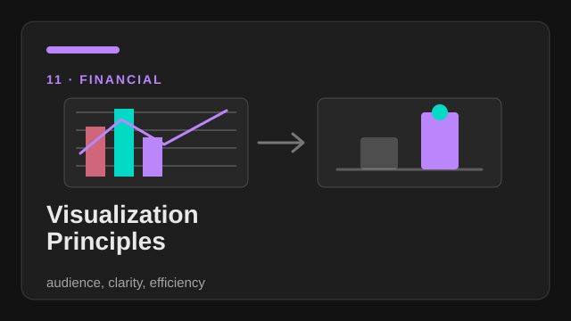</a>

<strong><a href="../chapters/ch11-financial-visualization-principles.md">Visualization Principles</a></strong> 
<em>audience, clarity, and efficiency.</em> 
<a href="../chapters/ch11-financial-visualization-principles.md">CH11</a> · <a href="../SKILL.md">skill route</a>

</td>
<td width="33%" valign="top">

<a href="../chapters/ch12-implementing-financial-visuals.md">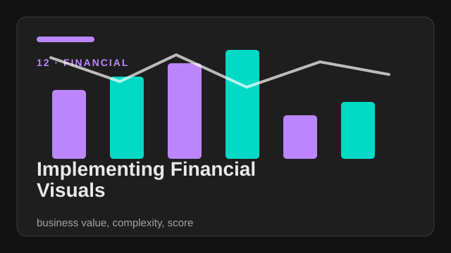</a>

<strong><a href="../chapters/ch12-implementing-financial-visuals.md">Implementing Financial Visuals</a></strong> 
<em>business value, complexity, and score.</em> 
<a href="../chapters/ch12-implementing-financial-visuals.md">CH12</a> · <a href="../SKILL.md">skill route</a>

</td>
</tr>
<tr>
<td width="33%" valign="top">

<a href="../chapters/ch13-graph-visualization-basics.md">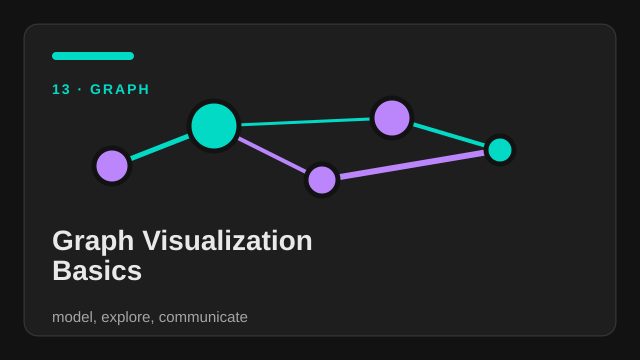</a>

<strong><a href="../chapters/ch13-graph-visualization-basics.md">Graph Visualization Basics</a></strong> 
<em>model, explore, and communicate.</em> 
<a href="../chapters/ch13-graph-visualization-basics.md">CH13</a> · <a href="../SKILL.md">skill route</a>

</td>
<td width="33%" valign="top">

<a href="../chapters/ch14-graph-case-studies.md">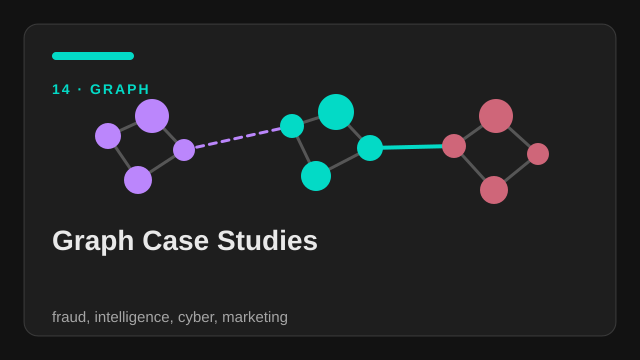</a>

<strong><a href="../chapters/ch14-graph-case-studies.md">Graph Case Studies</a></strong> 
<em>fraud, intelligence, cyber, and marketing.</em> 
<a href="../chapters/ch14-graph-case-studies.md">CH14</a> · <a href="../SKILL.md">skill route</a>

</td>
<td width="33%" valign="top">

<a href="../chapters/ch15-gephi-and-keylines.md">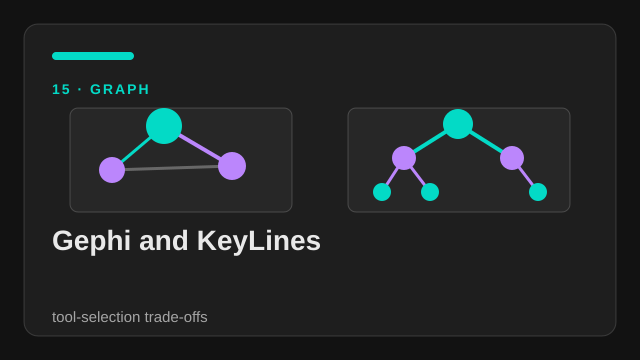</a>

<strong><a href="../chapters/ch15-gephi-and-keylines.md">Gephi and KeyLines</a></strong> 
<em>tool-selection trade-offs.</em> 
<a href="../chapters/ch15-gephi-and-keylines.md">CH15</a> · <a href="../SKILL.md">skill route</a>

</td>
</tr>
<tr>
<td width="33%" valign="top">

<a href="../chapters/ch16-graph-data-modeling.md">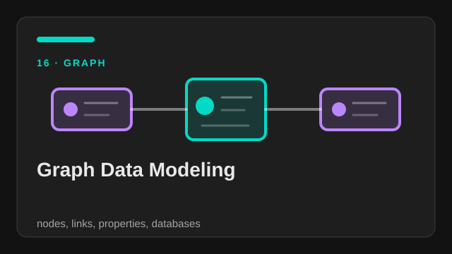</a>

<strong><a href="../chapters/ch16-graph-data-modeling.md">Graph Data Modeling</a></strong> 
<em>nodes, links, properties, and databases.</em> 
<a href="../chapters/ch16-graph-data-modeling.md">CH16</a> · <a href="../SKILL.md">skill route</a>

</td>
<td width="33%" valign="top">

<a href="../chapters/ch17-building-graph-visualizations.md">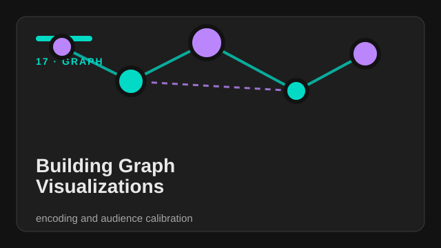</a>

<strong><a href="../chapters/ch17-building-graph-visualizations.md">Building Graph Visualizations</a></strong> 
<em>encoding and audience calibration.</em> 
<a href="../chapters/ch17-building-graph-visualizations.md">CH17</a> · <a href="../SKILL.md">skill route</a>

</td>
<td width="33%" valign="top">

<a href="../chapters/ch18-interactive-graph-visualizations.md">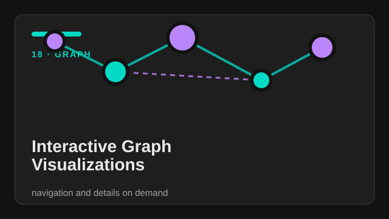</a>

<strong><a href="../chapters/ch18-interactive-graph-visualizations.md">Interactive Graph Visualizations</a></strong> 
<em>navigation and details on demand.</em> 
<a href="../chapters/ch18-interactive-graph-visualizations.md">CH18</a> · <a href="../SKILL.md">skill route</a>

</td>
</tr>
<tr>
<td width="33%" valign="top">

<a href="../chapters/ch19-graph-layouts.md">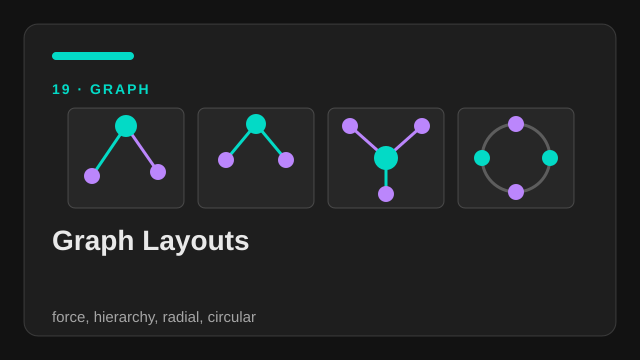</a>

<strong><a href="../chapters/ch19-graph-layouts.md">Graph Layouts</a></strong> 
<em>force, hierarchy, radial, and circular.</em> 
<a href="../chapters/ch19-graph-layouts.md">CH19</a> · <a href="../SKILL.md">skill route</a>

</td>
<td width="33%" valign="top">

<a href="../chapters/ch20-big-graph-data.md">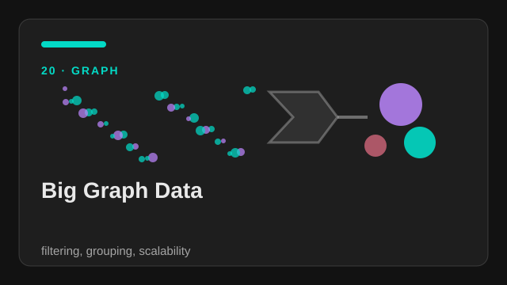</a>

<strong><a href="../chapters/ch20-big-graph-data.md">Big Graph Data</a></strong> 
<em>filtering, grouping, and scalability.</em> 
<a href="../chapters/ch20-big-graph-data.md">CH20</a> · <a href="../SKILL.md">skill route</a>

</td>
<td width="33%" valign="top">

<a href="../chapters/ch21-dynamic-graphs.md">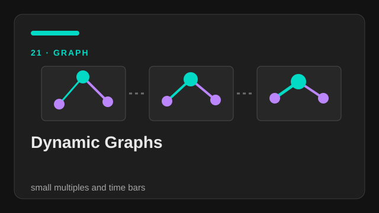</a>

<strong><a href="../chapters/ch21-dynamic-graphs.md">Dynamic Graphs</a></strong> 
<em>small multiples and time bars.</em> 
<a href="../chapters/ch21-dynamic-graphs.md">CH21</a> · <a href="../SKILL.md">skill route</a>

</td>
</tr>
<tr>
<td width="33%" valign="top">

<a href="../chapters/ch22-graphs-on-maps.md">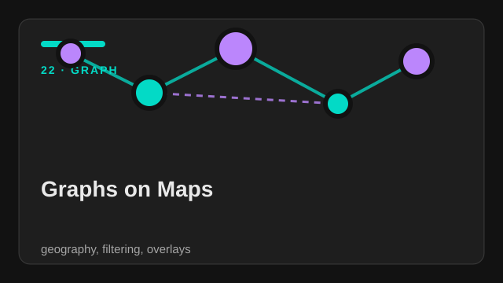</a>

<strong><a href="../chapters/ch22-graphs-on-maps.md">Graphs on Maps</a></strong> 
<em>geography, filtering, and overlays.</em> 
<a href="../chapters/ch22-graphs-on-maps.md">CH22</a> · <a href="../SKILL.md">skill route</a>

</td>
<td width="33%" valign="top">

<a href="../chapters/ch23-d3js-appendix.md">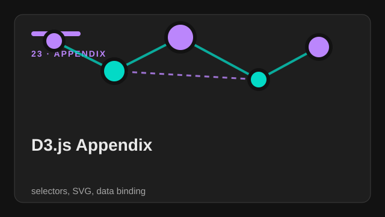</a>

<strong><a href="../chapters/ch23-d3js-appendix.md">D3.js Appendix</a></strong> 
<em>selectors, SVG, data binding, and simulation.</em> 
<a href="../chapters/ch23-d3js-appendix.md">CH23</a> · <a href="../SKILL.md">skill route</a>

</td>
<td width="33%" valign="top">

<a href="../examples/portfolio-tile/">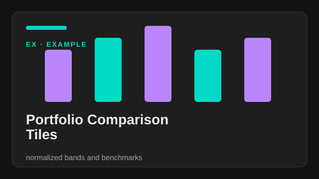</a>

<strong><a href="../examples/portfolio-tile/">Portfolio Comparison Tiles</a></strong> 
<em>normalized bands and benchmark context.</em> 
<a href="../examples/portfolio-tile/">EXAMPLE</a> · <a href="../SKILL.md">skill route</a>

</td>
</tr>
<tr>
<td width="33%" valign="top">

<a href="../examples/performance-waterfall/">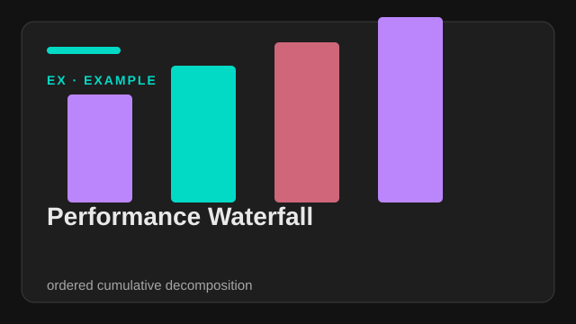</a>

<strong><a href="../examples/performance-waterfall/">Performance Waterfall</a></strong> 
<em>ordered cumulative decomposition and audit labels.</em> 
<a href="../examples/performance-waterfall/">EXAMPLE</a> · <a href="../SKILL.md">skill route</a>

</td>
<td width="33%" valign="top">

<a href="../examples/transaction-network/">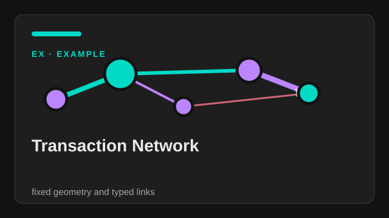</a>

<strong><a href="../examples/transaction-network/">Transaction Network</a></strong> 
<em>fixed geometry and typed links.</em> 
<a href="../examples/transaction-network/">EXAMPLE</a> · <a href="../SKILL.md">skill route</a>

</td>
</tr>
</table>

## Chapters

| Chapter | Focus | Key ideas |
|---|---|---|
| [ch01](../chapters/ch01-financial-visual-communications.md) | Financial visual communications | audience, narrative, multiple perspectives |
| [ch02](../chapters/ch02-benefits-of-visual-methods.md) | Benefits of visual methods | compare, connect, conclude |
| [ch03](../chapters/ch03-security-assessment-tile-framework.md) | Security assessment | Tile Framework, normalized comparison |
| [ch04](../chapters/ch04-portfolio-construction.md) | Portfolio construction | singular, multifaceted, varied views |
| [ch05](../chapters/ch05-trading-visual-system.md) | Trading | Contrail, ticker, quote, watchlist |
| [ch06](../chapters/ch06-performance-measurement.md) | Performance measurement | attribution, grids, linked views |
| [ch07](../chapters/ch07-financial-statements.md) | Financial statements | waterfall, cascade, transparency |
| [ch08](../chapters/ch08-pension-funds.md) | Pension funds | demographic and funding context |
| [ch09](../chapters/ch09-mutual-funds.md) | Mutual funds | reusable components, benchmark context |
| [ch10](../chapters/ch10-hedge-funds.md) | Hedge funds | glyphs, ranking, information-seeking |
| [ch11](../chapters/ch11-financial-visualization-principles.md) | Visualization principles | audience, clarity, efficiency |
| [ch12](../chapters/ch12-implementing-financial-visuals.md) | Implementing financial visuals | business value, complexity, Solution Score |
| [ch13](../chapters/ch13-graph-visualization-basics.md) | Graph visualization basics | graph model, explore vs communicate |
| [ch14](../chapters/ch14-graph-case-studies.md) | Graph case studies | fraud, intelligence, cyber, marketing |
| [ch15](../chapters/ch15-gephi-and-keylines.md) | Gephi and KeyLines | tool-selection trade-offs |
| [ch16](../chapters/ch16-graph-data-modeling.md) | Graph data modeling | nodes, links, properties, graph databases |
| [ch17](../chapters/ch17-building-graph-visualizations.md) | Building graph visualizations | visual encoding, audience calibration |
| [ch18](../chapters/ch18-interactive-graph-visualizations.md) | Interactive graph visualizations | navigation, decluttering, progressive expansion |
| [ch19](../chapters/ch19-graph-layouts.md) | Graph layouts | force, hierarchy, radial, circular |
| [ch20](../chapters/ch20-big-graph-data.md) | Big graph data | filtering, grouping, scalability |
| [ch21](../chapters/ch21-dynamic-graphs.md) | Dynamic graphs | small multiples, time bars, dynamic properties |
| [ch22](../chapters/ch22-graphs-on-maps.md) | Graphs on maps | geographic modeling, filtering, overlays |
| [ch23](../chapters/ch23-d3js-appendix.md) | D3.js appendix | selectors, SVG, data binding, force simulation |

## Runnable examples

| Example | Use it to learn | Open |
|---|---|---|
| Portfolio comparison tile | normalized bands, benchmarks, and consistent security grammar | [folder](../examples/portfolio-tile/) |
| Performance waterfall | ordered cumulative decomposition and audit labels | [folder](../examples/performance-waterfall/) |
| Transaction network | fixed geometry, typed links, weight, and group semantics | [folder](../examples/transaction-network/) |

## Supporting files

| File | Purpose |
|---|---|
| [`cheatsheet.md`](../cheatsheet.md) | compact decisions and trade-offs |
| [`patterns.md`](../patterns.md) | reusable visualization patterns |
| [`glossary.md`](../glossary.md) | terms with chapter references |
| [`references/source-notes.md`](../references/source-notes.md) | provenance, extraction notes, and limits |
| [`references/visual-index.md`](../references/visual-index.md) | local-only source visual routing |
| [`scripts/validate_examples.py`](../scripts/validate_examples.py) | dependency-free example smoke test |
